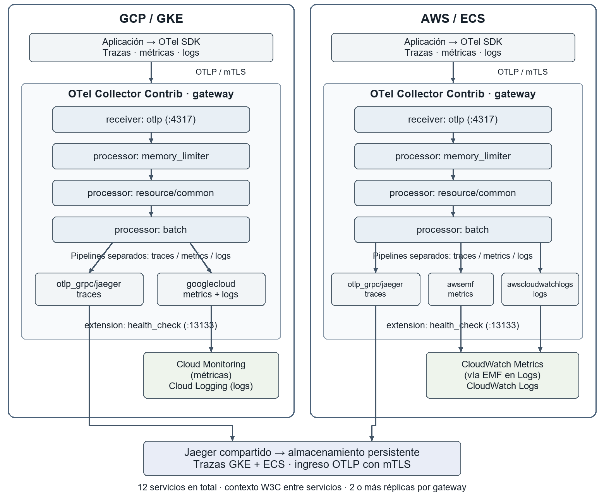

# Observabilidad con OpenTelemetry para un e-commerce multinube

Entrega académica parcial de los **puntos 1 y 2**: ADR y pipeline de telemetría para 12 microservicios en GCP GKE y AWS ECS.

## Documentos

- [Ver el PDF de 8 páginas](OpenTelemetry_ADR_y_Pipeline.pdf)
- [Descargar el Word editable](OpenTelemetry_ADR_y_Pipeline.docx)
- [Descargar el paquete de documentos y anexos](Entrega_OpenTelemetry_Puntos_1_y_2.zip)
- [Guía para que el grupo complete los puntos 3, 4 y 5](GUIA_PARA_COMPANEROS.md)

La portada contiene campos pendientes para los integrantes, institución, asignatura y docente. El documento incluye citas y referencias en formato APA 7.

## Contenido desarrollado

1. **ADR-001, formato de Michael Nygard:** estado, contexto, opciones consideradas, decisión y consecuencias.
2. **Pipeline de instrumentación:** aplicación → OTel SDK → OTel Collector → backends, con receivers, processors, exporters y extensión de salud.

La propuesta utiliza gateways por nube. Las métricas y los logs se envían al backend de su nube; las trazas de GKE y ECS convergen en Jaeger.

| Señal | GCP | AWS |
| --- | --- | --- |
| Métricas | Cloud Monitoring mediante googlecloud | CloudWatch mediante awsemf |
| Logs | Cloud Logging mediante googlecloud | CloudWatch Logs mediante awscloudwatchlogs |
| Trazas | Jaeger compartido mediante OTLP | Jaeger compartido mediante OTLP |

## Arquitectura

[Editar el diagrama en Mermaid](arquitectura.mmd).

## Configuración del Collector

| Archivo | Uso |
| --- | --- |
| [collector-base.yaml](collector-base.yaml) | Recepción OTLP con mTLS, processors y exportación de trazas |
| [collector-gcp.yaml](collector-gcp.yaml) | Perfil de métricas y logs para GCP |
| [collector-aws.yaml](collector-aws.yaml) | Perfil de métricas y logs para AWS |
| [collector-gcp-completo.yaml](collector-gcp-completo.yaml) | Base y perfil GCP combinados |
| [collector-aws-completo.yaml](collector-aws-completo.yaml) | Base y perfil AWS combinados |
| [sdk-ejemplo.env](sdk-ejemplo.env) | Variables orientativas del SDK, sin credenciales reales |

Versión de referencia: **Collector Contrib 0.160.0**. Especificación consultada: **OpenTelemetry 1.61.0**. Las Semantic Conventions se versionan por separado.

Con el binario correspondiente, certificados y variables configurados:

~~~sh
otelcol-contrib validate --config=collector-gcp-completo.yaml
otelcol-contrib validate --config=collector-aws-completo.yaml
~~~

Para arrancar, elegir el archivo completo de la nube correspondiente o combinar la base con un único perfil. No cargar ambos perfiles en el mismo Collector.

Se verificaron la sintaxis YAML, las referencias entre componentes y la presentación del PDF. Las pruebas con el binario del Collector, autenticación cloud y carga a 10k RPS quedan pendientes. Consultar [VALIDACION.txt](VALIDACION.txt).

## Continuidad del equipo

- [ ] **Punto 3:** comparar instrumentación automática y manual: tiempo de desarrollo, CPU/memoria y granularidad.
- [ ] **Punto 4:** justificar head-based o tail-based sampling para 10k RPS y analizar su impacto en SLIs.
- [ ] **Punto 5:** definir atributos semánticos para HTTP, DB, RPC y eventos de negocio.
- [ ] Completar portada, integrar las secciones y ajustar el documento final a las 6–8 páginas exigidas.

El YAML todavía no establece una política de sampling. Si el grupo elige tail sampling, deberá reunir los spans de cada traza en el mismo sampler, incluso cuando crucen nubes. Los SLIs deben basarse en métricas de todas las solicitudes elegibles, independientemente del muestreo de trazas.

La [guía de continuidad](GUIA_PARA_COMPANEROS.md) incluye tablas sugeridas, fórmulas de volumen, criterios de medición y condiciones de integración.

## Fuentes principales

- [OpenTelemetry Specification](https://opentelemetry.io/docs/specs/otel/)
- [OpenTelemetry Collector](https://opentelemetry.io/docs/collector/)
- [Michael Nygard: Documenting architecture decisions](https://cognitect.com/blog/2011/11/15/documenting-architecture-decisions)
- [Google Cloud: Instrument for Cloud Trace](https://docs.cloud.google.com/trace/docs/setup)

Las referencias completas y las fuentes de los exportadores están en el documento.
